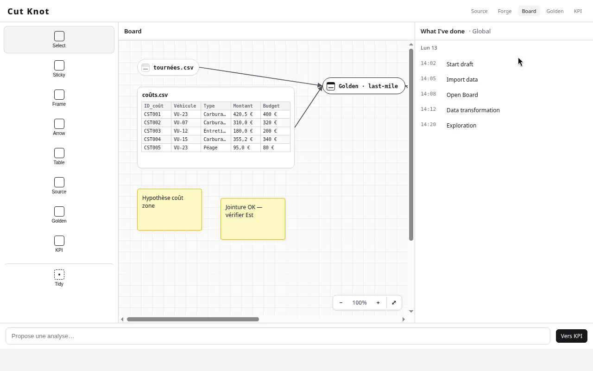

# Cut Knot

> **Status:** early prototype — unfinished. The shell works; real import, living joins, provenance, and acting AI are still ahead.

Most people only use about **10%** of apps like Excel or Miro — enough to calculate a few things, sketch a board, get the answer. What if an app had **only** that 10% of each?

**Cut. Knot. Done.** — 10% Excel + 10% board → enough for 100% of the task.

Cut Knot is that slice: **Source → Board** (sources, Golden, KPI cards) plus full-screen **Forge**.

## Interface



## What’s in this repo today

| Area | State |
|------|--------|
| **Source** — Nouveau / Load | Mock drafts |
| **Board** — sources (chip ↔ preview), Golden, KPI cards, notes, arrows, zoom | UI prototype |
| **Forge** — filter, sort, formulas, selection | UI prototype |
| Real CSV import, live Golden, provenance graph, acting AI chat | **Not built yet** |

Stack: React 19 + TypeScript + Vite 8. Front-only for now (no backend).

## License

Copyright 2026 Hassen-Ti  
Licensed under the [Apache License, Version 2.0](LICENSE).

## Run

```bash
npm install
npm run dev
```

## Build

```bash
npm run build
npm run preview
```
